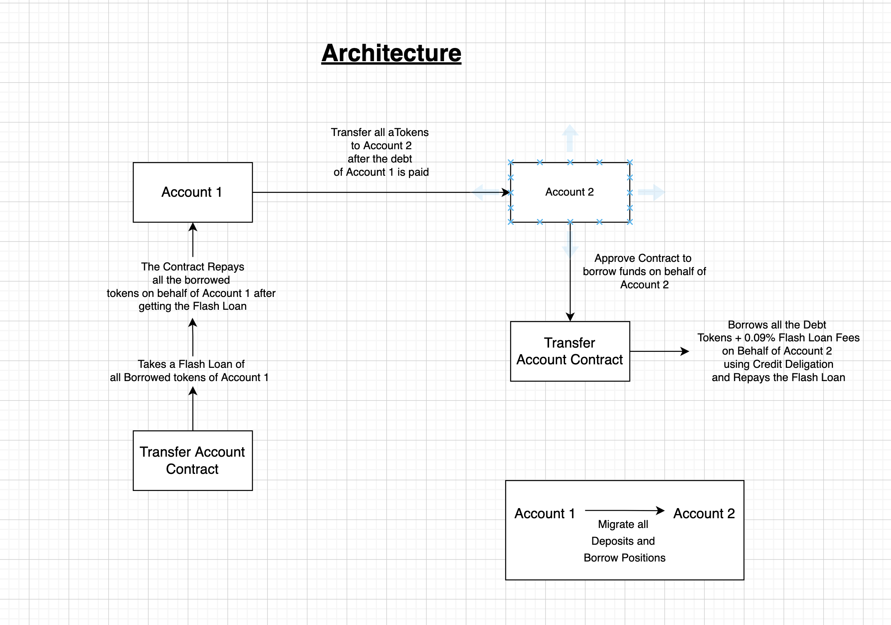

# AAVE TRANSFER ACCOUNT



# 🏄‍♂️ Quick Start

> clone/fork aave-transfer-account:

```bash
git clone https://github.com/brotherlymite/aave-transfer-account.git
```

> install

```
yarn install
```

> Start your 📱 frontend:

```
yarn start
```

> 🛰 Deploy your contract:

```bash
cd packages/hardhat
npx hardhat run --network kovan scripts/deploy.js
```

> Verify your contract on Etherscan:
```
npx hardhat verify YOUR_CONTRACT_ADDRESS AAVE_LENDING_POOL_ADDRESS --network kovan
```

📱 Open http://localhost:3000 to see the app

🔏 All the contracts are located in `packages/hardhat/contracts`

📝 The frontend app is located in `packages/react-app/src`

# Credits

Flash Loan template used from: https://github.com/PatrickAlphaC/aave-flashloan-mix
